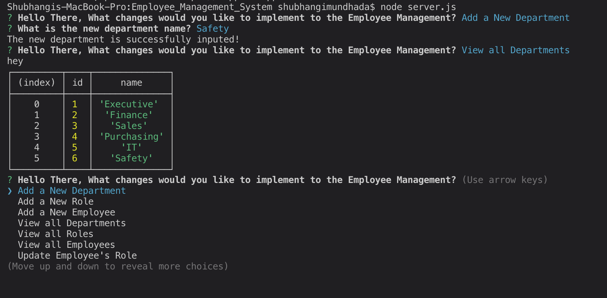
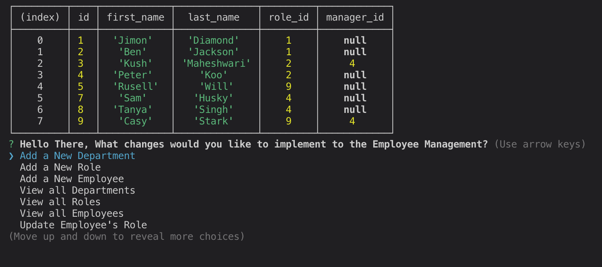

# Employee_Management_System
---

## Table of Contents
---
* [Description](#Description)
* [Installation](#Installation)
* [Usage](#Usage)
* [Contributors](#Contributors)
* [Test](#Test)
* [License](#License)
* [Questions](#Questions)
* [Demo](#Demo)

## Description 
---
This project is made so that user can monitor the company organizational structure. The user is able to add new employees, roles, and department while being able to modify them. They can delete or update any new changes that has occured in the company. The user can also see which manager's team by choicing their name. They can also acquire the calculation of the total budget allocated for a certain department by summing up their total salary.   

## Installation 
---
npm install node when you download the file, this way all the required packages will be loaded into your project to be used. 

## Usage 
---
In order to run the project just type in node server.js and start typing in the information that needs to be modified. 

## Contributors
---
Shubhangi Mundhada

## Test
---
Jest

## License
---
MIT

## Questions
---
Github Link - https://github.com/smundhada
Email - shubhimundhada@gmail.com

## Demo 
---
[demo-link](https://www.youtube.com/watch?v=3iTkCIn4ROs&feature=youtu.be)

